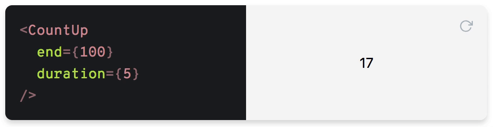

## countup.js というライブラリのソースコードの解説

私は Reactjs を学習中のものなのですが以前、カウントアップのアニメーションを実装しようと、react-countup というライブラリを使用したことがありました。このライブラリを使用することで簡単にカウントアップするアニメーションを作ることができたのですが、カウントがアップしても再レンダリングが起こっていないことを疑問に感じました。以下がそのライブラリのデモです。


上の gif 画像からは分かりませんが、上のように count の数値が変化しても再レンダリングが起きていません。私は Reactjs で何かしら画面が変わったら、それは再レンダリングが起こっていると思っていたため、それに疑問を覚えました。その疑問が忘れられず、react-countup のライブラリを調査することにしました。すると、このライブラリは countup.js というライブラリに強く依存していることが分かり、このライブラリのソースコードを見たところ、疑問を解消することができました。このレポジトリは countup.js のソースコードを解説したもので、自分用のメモです。結論だけ書くと、countの数値が変わっても際レンダリングが起きないのは、countup.jsは直接DOMを操作しているのであって、countをステートとして扱っているわけではないからでした。

ちなみに、countup.js は vanilla js では以下のように使います

```
const countUp = new CountUp('targetId', 1000);
if (!countUp.error) {
  countUp.start();
} else {
  console.error(countUp.error);
}
```

このように、CountUpクラスをインスタンス化してstartメソッドを走らせれば、count が 0 から 1000 までカウントアップするアニメーションが実装できます。react-countupも、上記のようにCountUpクラスをインスタンス化してアニメーションを実装しています。デモサイトがあるのでリンクを貼っておきます。

[デモサイトのリンク(https://inorganik.github.io/countUp.js/)](https://inorganik.github.io/countUp.js/)

### countup.js 　のソースコードの概要

さほど長いコードではありませんが、それでも 300 行以上のコードが書かれてあり、その全てを説明するわけにはいかないので、重要な箇所だけ説明していきます。また、useEasing というオプションが true だとやや処理が複雑になるので(デフォルトではtrueになっています)、このオプションは false にしているという前提で進めさせてもらいます。useEasingがfalseだと、最初は早くカウントアップして、徐々にそのカウントアップの速度が遅くなるというアニメーションを実装できます。例えば、上のgif画像を見ると、100に近づくごとにカウントアップする速度が遅くなっていることがわかると思います。これはuseEasingがtrueの場合に実現できます。逆にfalseだと、常に一定の速度でカウントアップされます。
つまり、
```
const countUp = new CountUp('targetId', 1000, { useEasing: false });
if (!countUp.error) {
  countUp.start();
} else {
  console.error(countUp.error);
}
```
以上のコードのように、オプションに「{ useEasing: false }」を渡しているという前提の解説です


1. 
```
export class CountUp {

  version = '2.8.0';
  private defaults: CountUpOptions = {
    以下のデフォルト値も分かりやすいように一部省略しています
    startVal: 0,
    duration: 2,
    useEasing: true,
  };

  以下一部省略
  ...

  constructor(
    target: string | HTMLElement | HTMLInputElement,
    private endVal: number,
    public options?: CountUpOptions
  ) {
    this.options = {
      ...this.defaults,
      ...options
    };

    //以下一部中略
    ...
    this.startVal = this.validateValue(this.options.startVal);
    this.frameVal = this.startVal;
    this.endVal = this.validateValue(endVal);
    //以下一部省略
    ...
    this.el = (typeof target === 'string') ? document.getElementById(target) : target;
    if (this.el) {
      this.printValue(this.startVal);
    } else {
      this.error = '[CountUp] target is null or undefined';
    }

    //以下一部中略
    ...


    printValue(val: number): void {

    // 以下一部省略

    // 下のresultには、初期ではstartVal、特に何も設定しなければ0が格納されています
    const result = this.formattingFn(val);


    // この下のDOM操作によって、startVal、デフォルトでは0を画面に表示させています
    if (this.el.tagName === 'INPUT') {
      const input = this.el as HTMLInputElement;
      input.value = result;
    } else if (this.el.tagName === 'text' || this.el.tagName === 'tspan') {
      this.el.textContent = result;
    } else {
      this.el.innerHTML = result;
    }
  }
}
```

上のコードは要するに

```
const countUp = new CountUp('targetId', 1000);
```

というふうに、CountUp クラスをインスタンス化する際、第一引数に何かしらの文字列を入れるのですが、その要素が見つかれば、その要素の value か textContent あるいは innterText に startVal、デフォルトでは 0 が表示させています。

2. そして、

```
const countUp = new CountUp('targetId', 1000);
```

このようにインスタン化した後に、

```
if (!countUp.error) {
  countUp.start();
} else {
  console.error(countUp.error);
}
```

このように、start メソッドを呼び出しています。では、start メソッドはどのような処理を行なっているのでしょうか

```
  start(callback?: (args?: any) => any): void {
   以下一部省略
   ...
      this.rAF = requestAnimationFrame(this.count);
  }
```

duration が 0 より大きかったら(デフォルトでは「2」がセットされているので、if 文の方に分岐します)、this.rAF = requestAnimationFrame(this.count);こちらの処理が呼び出されます。では this.count を見てみましょう

```
count = (timestamp: number): void => {
    if (!this.startTime) { this.startTime = timestamp; }

    const progress = timestamp - this.startTime;

    //以下一部省略

    this.frameVal = this.startVal + (this.endVal - this.startVal) * (progress / this.duration);


    // frameValを指定した要素の value か textContent あるいは innterTextに表示させている
    this.printValue(this.frameVal);

    // 指定した秒数に達しなかったら再帰呼び出しされる
    if (progress < this.duration) {
      this.rAF = requestAnimationFrame(this.count);
    }
  }
```

count メソッドは最初に、startTime という変数に timestamp を格納します。timestamp は requestAnimationFrame コールバック関数に渡される引数で、ブラウザがこの関数を呼び出すときの時間情報です。この timestamp は、アニメーションフレームを開始する前の現在の時刻を表します。そして、

```
this.frameVal = this.startVal + (this.endVal - this.startVal) * (progress / this.duration);
```

これによって、表示する数値を決めています。そして最後に、指定した duration の秒数に達していなかったら、

```
    if (progress < this.duration) {
      this.rAF = requestAnimationFrame(this.count);
    }
```

上記のコードにより再帰呼び出しが行われます。
ちなみに、requestAnimationFrame はブラウザにもよりますが、大体 1 秒あたり 60 回呼び出されます。

例えば、endVal を 1000、duration を 2 に設定した場合、

-  [0.5 秒経った場合]

```
 this.frameVal = this.startVal + (this.endVal - this.startVal) * (progress / this.duration);
```

上記のコードは

0[startVal] + 1000[endVal - startVal] \* (0.5 / 2)[progress / this.duration] = 250

となり、printVal 関数によって、指定した要素に 250 が表示されます

-  [1 秒経った場合]

上の計算式が行われ、

0[startVal] + 1000[endVal - startVal] \* (1 / 2)[progress / this.duration] = 500

となります。そして、printVal 関数によって、指定した要素に 500 が表示されます

-  [1.5 秒経った場合]

同様に上の計算式が行われ、this.frameVal は 750 が格納され、指定した要素に 750 が表示されます

- [2 秒経った場合]

同様に上の計算式が行われ、this.frameVal は 1000 が格納され、指定した要素に 1000 が表示されます

## 結論

要するに、react-countupはcountup.jsというライブラリに依存しており、そのcountup.jsはvalueや textContent、innerHTML などの DOM 経由で表示する数値を変えているのであって、別に count をステートとして管理していない。そのため、count の数値が変わっても、再レンダリングが起きないというわけです。
